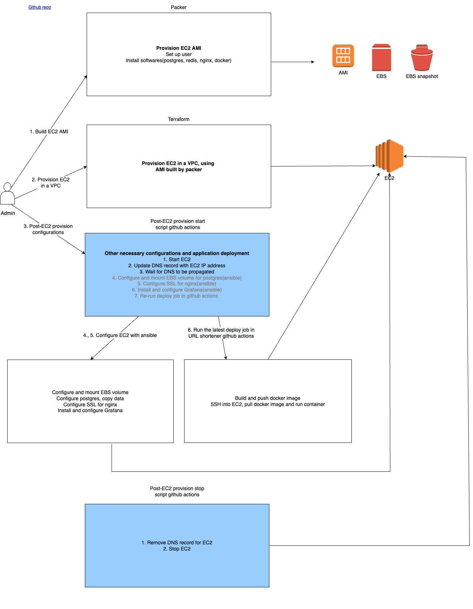

# Introduction
This project is the infrastructure as code management for [URL shortener backend](https://github.com/hanchiang/url-shortener-backend) using AWS.

# Structure
* `images/`: Packer files for building AMI
    * `image.pkr.hcl`: Main packer script
    * `scripts/`: Scripts to be run when provisioning AMI
* `instances/`: Terraform files to provision EC2 in VPC
    * `main.tf`: Main terraform script
    * `ansible/`: Ansible scripts to run post-provisioning tasks such as mounting EBS volume, set up file system, copy postgres data, setup SSL for nginx 
    * `scripts/`: Scripts to automate(everything after step 2 of the workflow) start and stop of EC2, DNS, and deployment of [URL shortener backend](https://github.com/hanchiang/url-shortener-backend). Calls ansible scripts

# Workflow
## 1. Provision EC2 AMI using packer
Provisions a EBS-backed EC2 AMI, and install the necessary softwares for [URL shortener backend](https://github.com/hanchiang/url-shortener-backend), i.e. postgres, redis, as well as nginx

cd into `images/`
Define variables that are declared in `image.pkr.hcl` in a new file `variables.auto.pkrvars.hcl`
Build image: `packer build -machine-readable -var-file variables.auto.pkrvars.hcl image.pkr.hcl | tee build.log`

## 2. Provision EC2 in a VPC using terraform
cd into `instances/`
Copy the AMI ID from packer build, update it in `variables.tf`
Provision infra: `terraform apply`

Everything from here onwards is handled in `instances/scripts/start.sh`

## 3. Attach EBS volume and copy postgres data over
Store postgres data in a separate EBS volume so that it survives a new image build/EC2 termination
`ansible/setup-file-system.sh <ssh user> <ssh private key path>`

## 4. configure SSL for nginx**
This needs to be done after EC2 is provisioned and its IP addresss is set in route 53
`ansible/nginx-https.sh <ssh user> <ssh private key path>`

## 5. Deploy application
Rerun the latest deploy job in github action

## Diagram
**Traffic flow**

**Deployment pipeline**

# Operational hours
EC2 and URL shortener will run from:
* 12pm UTC - 2pm UTC on weekdays
* 2am UTC - 4am UTC, 6am UTC - 3pm UTC on weekends

## TODO:
* Replace shell provisioner with ansible provisioner in packer, move configurations to a separate ansible playbook to be run after EC2 is created
* Use ansible roles to define configurations
* IAM user and policies for system admin
* container image scan
* Collect metric
* Centralised log collection
* Nginx: Extract common location config into a file
* Use terraform vault to store secrets